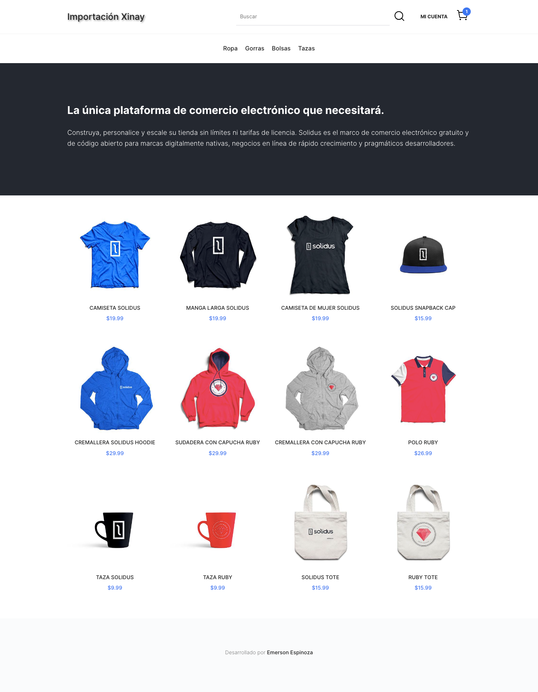
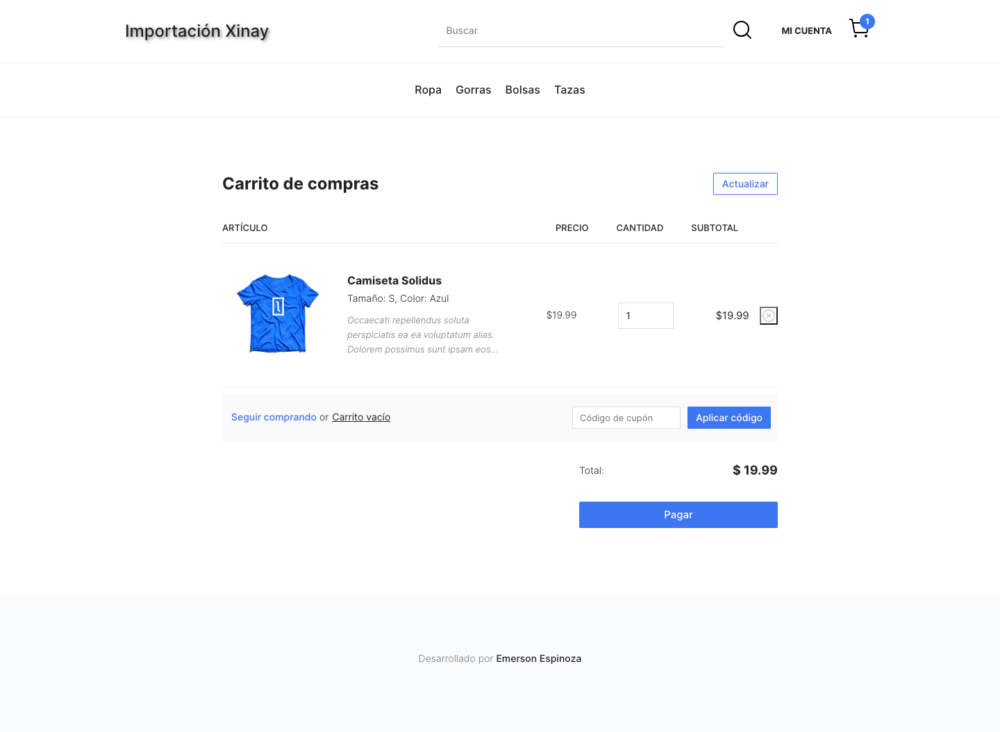
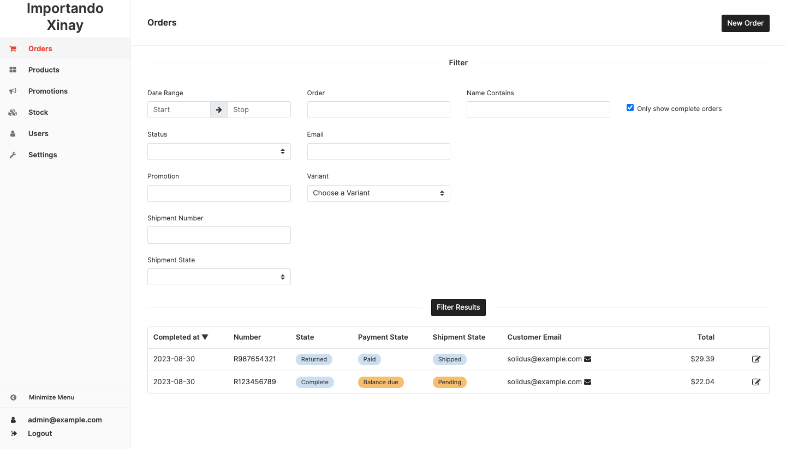

# E-commerce con Ruby On Rails 
## Requsitos para hacer andar este proyecto 

<ul>
  <li>ruby 3.2.1 </li>
  <li>Rails 7.0.7.2 </li>
</ul>

## clonar proyecto 
```bash
git clone git@github.com:emersonxinay/ecomerce_con_ruby_on_rails.git
```
## ubicarme a la carpeta 
```bash
cd ecomerce_con_ruby_on_rails
```

## instalar todas las dependencia
```bash
bundle install
```

## crear la base de datos 
```bash
rails db:create
```

## para migrar los datos 
```bash
rails db:migrate
```

## para correr el programa
```bash
rails s
```
### imagen demo






